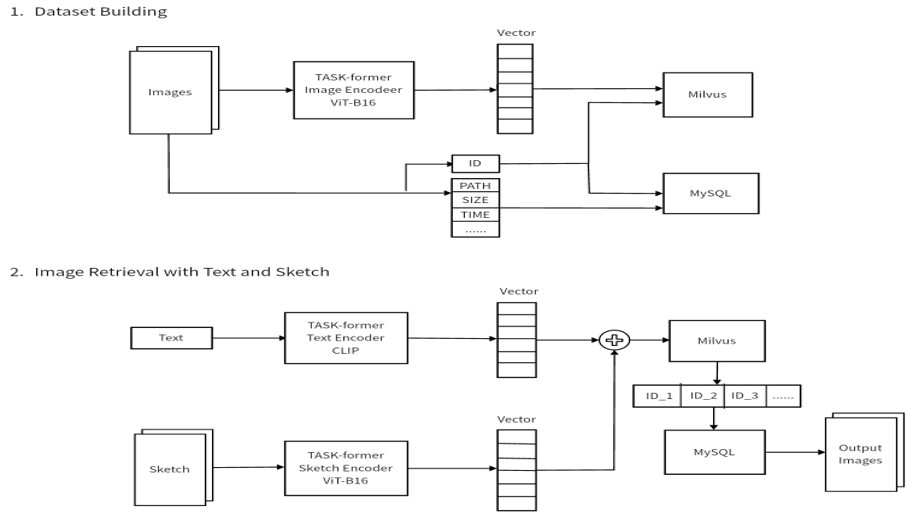

# Image Retrieval with Text and Sketch

This project is based on TASK-former (Text And SKetch transformer) proposed in ECCV paper [A Sketch Is Worth a Thousand Words: Image Retrieval with Text and Sketch](https://link.springer.com/chapter/10.1007/978-3-031-19839-7_15).

We use TASK-former to extract features, and use vector dataset Milvus to build a system that can perform image retrieval with both a sketch and a text query.

Our code is based on:

- TASK-former offical implement: https://github.com/janesjanes/tsbir
- Milvus Bootcamp: https://github.com/milvus-io/bootcamp/tree/master/applications/image/reverse_image_search

The system architecture is as below:



## Local Deployment

### Requirements

- [Milvus 2.2.10](https://milvus.io/)
- [MySQL](https://hub.docker.com/r/mysql/mysql-server)
- [Python3](https://www.python.org/downloads/)
- [Pytorch](https://pytorch.org)
- [Docker](https://docs.docker.com/engine/install/)
- [Docker Compose](https://docs.docker.com/compose/install/)

## Deploy with Docker

### 1. Start Milvus & Mysql

First, you need to start Milvus & Mysql servers.

```bash
$ git clone https://gitee.com/ex2333/text_sketch_img_retrieval
$ docker-compose up -d
```

### 2. Start API Server

Then to start the system server, and it provides HTTP backend services.

- **Install the Python packages**

> Please note the Milvus version should [match pymilvus](https://milvus.io/docs/release_notes.md#Release-Notes) version in [requirements.txt](./server/requirements.txt). And this tutorial uses [milvus 2.2.10](https://milvus.io/docs/v2.2.x/install_standalone-docker.md) and [pymilvus 2.2.11](https://milvus.io/docs/release_notes.md#2210).

```bash
$ cd text_sketch_img_retrieval/server
$ pip install -r requirements.txt
$ pip3 install torch torchvision torchaudio --index-url https://download.pytorch.org/whl/cu118
```

- **Download model weights**

Download weights of TASK-former from [here](https://link.springer.com/chapter/10.1007/978-3-031-19839-7_15), and save as `server\src\task_former\tsbir_model_final.pt`.

- **Run the code**

Then start the server with Fastapi.

```bash
$ python src/main.py
```

### 3. Start Client

Next, start the frontend GUI.

- **Run Docker**

First, build a docker image.

```bash
$ cd text_sketch_img_retrieval/client/
$ docker build -t tsir_client:latest .
```

Then, build and run a docker container.

```bash
$ docker run -d -p 3000:80 --name tsir_client tsir_client:latest
```

Navigate to 127.0.0.1:3000 in your browser to access the front-end interface.
